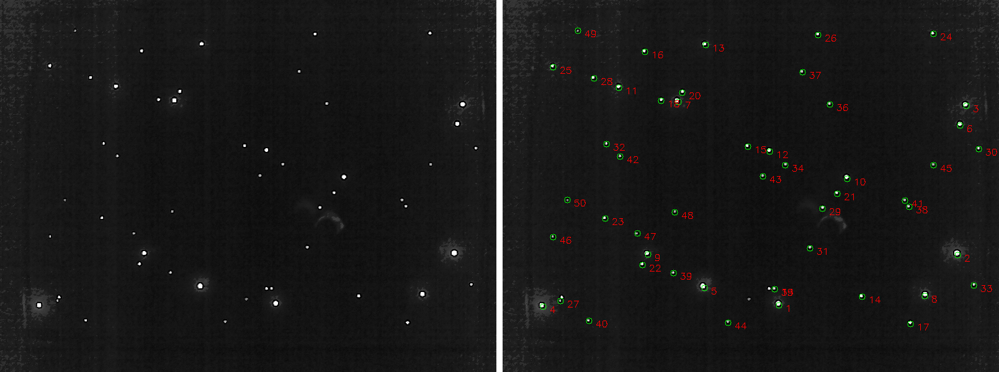
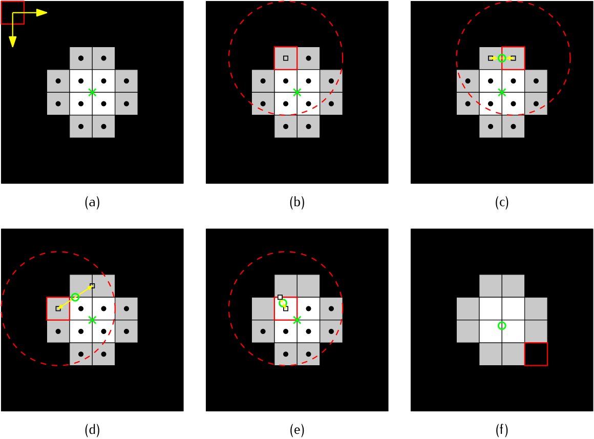

# Summary

The number of nanosatellites and picosatellites being launched have increased over the years. Associated with this growth, these smaller satellites have incrementally being able to replace functions previously only performed by bigger satellites, by the means of miniaturisation of their components. The reduced physical volume also implies in smaller solar panels and batteries being employed, resulting in stricter energy constraints for the satellite subsystems. These constraints have brought a demand for technology development toward optimising size, mass and energy consumption of CubeSat components.

At the beginning of space exploration, due to limitations in the available technologies, positioning and navigation systems were little efficient. For example, the first star trackers used to have film cameras through an almost entirely analog process [@zhang2017]. With the advance of electronics and the exponential growth of embedded devices processing capacity, the use of these types of sensors and system has becoming each time more accessible.

The use of star trackers began to be more widespread with the emergence of the first public star catalogs in the 1990s, such as, for example, the Hipparcos [@hipparcos-catalog]. Despite the advent of the CubeSat standard in 1999 [@cds], the use of such sensors in small-sized satellites only started to be explored by the end of the 2000s, possibly due to the technological limitations (required physical size and power consumption) and lack of commercial solutions [@mcbryde-thesis].

In this context, CEST (Centroid Extractor for Star Trackers) is an algorithm for identifying and determining the stars centroid in an image without storing the entire captured image and without the need for external memories or buffer [@marcelino2020].

# Centroid Determination

Considering that the input signal has a Gaussian behavior (pixels of stars), we propose the use of an IIR (infinite impulse response) filter to estimate the central coordinates of the centroids. For this purpose, it is possible to use a first-order filter (applied separately on each axis of the image) and with a gain that is constant and smaller than one, as presented in the following equations:

\begin{subequations}
    \begin{align}
        & X_{n} = [x_{n}, y_{n}] \\
        & G_{n} = a^{n} \\
        & Y_{n} = G_{n} \cdot X_{n} + (1 - G_{n}) \cdot Y_{n-1}
    \end{align}
\end{subequations}

with:

\begin{equation}
    \left\{ \begin{array}{l}
        Y_{0} = X_{0} \\
        a = 0.8 \\
    \end{array}\right.
\end{equation}

where:

* $x$ is a pixel position in the x-axis;
* $y$ is a pixel position in the y-axis;
* $X$ is the measured value (x and y-axis coordinates);
* $G_{n}$ is the weight of the current pixel;
* $a$ is an optimal constant to minimize the centroid position error;
* $Y_{n}$ is the estimation in the current iteration;
* $Y_{n−1}$ is the estimation of the previous iteration.

To illustrate this process, we have matrix (\ref{eq:ex-single-star-matrix}), which represents a hypothetical image with a single star. Upon applying the previous equations to this matrix, after it goes through the threshold filter with a threshold equal to 150, we arrive at the results of Figure \ref{fig:result-demo}. In this example, the system origin is the upper left corner, and the reading direction is from left to right, and from top to bottom.

\begin{equation}
    S =
    \begin{bmatrix}
        0 &   0 &   0 &   0 &   0 &   0 &   0 &   0 &   0 \\
        0 &   0 &   0 &   0 &   0 &   0 &   0 &   0 &   0 \\
        0 &   0 &   0 &   0 & 200 &   0 &   0 &   0 &   0 \\
        0 &   0 &   0 & 220 & 240 & 220 &   0 &   0 &   0 \\
        0 &   0 & 200 & 240 & 240 & 240 & 220 &   0 &   0 \\
        0 &   0 &   0 & 220 & 240 & 220 &   0 &   0 &   0 \\
        0 &   0 &   0 &   0 & 200 &   0 &   0 &   0 &   0 \\
        0 &   0 &   0 &   0 &   0 &   0 &   0 &   0 &   0 \\
        0 &   0 &   0 &   0 &   0 &   0 &   0 &   0 &   0 \\
    \end{bmatrix}
    \label{eq:ex-single-star-matrix}
\end{equation}

The proposed algorithm is also demonstrated in Figure \ref{fig:algorithm-demo}.

# Conclusion

With this work, it was possible to develop a more efficient algorithm for the extraction of centroids in star trackers. By implementeing CEST using dedicated hardware, we reduced the complexity of the processing steps of the captured images. Besides the initial objective of facilitating the use of this type of sensor in nanosatellites, making the hardware architecture more straightforward, it was also possible to reduce the runtime of the reading cycles and to obtain a subpixel-level precision.

Another aspect of prominence was the testing environment built to validate the entire sensor. This platform will allow running more comprehensive tests and can be used in the integration phase of a future flight version, or even to test other star tracker models.

# References
