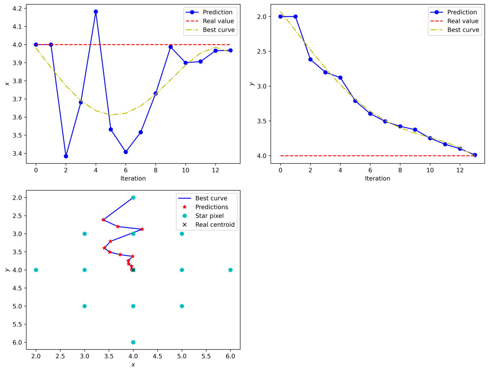

# Summary

The number of nanosatellites and picosatellites being launched have increased over the years. Associated with this growth, these smaller satellites have incrementally being able to replace functions previously only performed by bigger satellites, by the means of miniaturization of their components. The reduced physical volume also implies in smaller solar panels and batteries being employed, resulting in stricter energy constraints for the satellite subsystems. These constraints have brought a demand for technology development toward optimizing size, mass and energy consumption of CubeSat components.

At the beginning of space exploration, due to limitations in the available technologies, positioning and navigation systems were little efficient. For example, the first star trackers used to have film cameras through an almost entirely analog process [@zhang2017]. With the advance of electronics and the exponential growth of embedded devices processing capacity, the use of these types of sensors and system has becoming each time more accessible.

The use of star trackers began to be more widespread with the emergence of the first public star catalogs in the 1990s, such as, for example, the Hipparcos [@hipparcos-catalog]. Despite the advent of the CubeSat standard in 1999 [@cds], the use of such sensors in small-sized satellites only started to be explored by the end of the 2000s, possibly due to the technological limitations (required physical size and power consumption) and lack of commercial solutions [@mcbryde-thesis].

The centroid extraction or determination, is the first step of the processing chain of a star tracker sensor. After finding the centroids of the stars, there are at least two more steps: star identification (using a catalog) and the attitude determination. These two last steps are covered by this library.

In this context, CEST (Centroid Extractor for Star Trackers) is a library for identifying and determining the stars centroids in an image, by processing a stream of pixels without storing the entire captured image and without the need for large memory buffers (in an embedded context).

This work presents a library that implements the developed algorithm in [@marcelino2020]. The library is divided in two parts: A threshold filter, to detect all star pixels, and the centroid determination. There are two different implementations for the threshold filter: a software and a hardware implementation (using hardware description and simulation).

# Star Centroid Determination

The centroid determination algorithm implemented in this library is divided in two steps: threshold filter and centroid coordinates estimation. These steps are presented below.

## Threshold Filter

The first step of the implemented centroid determination method is the threshold filter. This filter has the purpose of find the star pixels and discard the background pixels of the image in analysis. Being the starry sky images relatively simple (a black image with white dots representing stars), it is possible to obtain the star pixels by applying a color threshold filter with a pre-determined threshold value.

In this library, there are two implementations of this step. The first is a pure software implementation and the second is a hardware implementation. This hardware implementation is a VHDL (VHSIC Hardware Description Language) description that can be used in a real hardware between the camera interface and the microprocessor (using a CPDL, a FPGA or an ASIC device). Another possible usage of this hardware description is in a simulation environment. To simulate this hardware together with a simulated camera interface, a GHDL [@ghdl] simulation is also available. This simulation reads an image file and transmits its pixel through a CSI bus (Camera Serial Interface) to the star pixels filter step. After filtered, the star pixels are stored in a CSV file to be read by the next step of the processing chain.

## Centroid Coordinates Estimation

Considering the output of the threshold filter step as a signal with Gaussian behavior (pixels of stars), we propose the use of an IIR (infinite impulse response) filter to estimate the central coordinates of the centroids. For this purpose, it is possible to use a first-order filter (applied separately on each axis of the image) and with a gain that is constant and smaller than one, as presented in the following equations:

\begin{subequations}
    \begin{align}
        & X_{n} = [x_{n}, y_{n}] \\
        & G_{n} = a^{n} \\
        & Y_{n} = G_{n} \cdot X_{n} + (1 - G_{n}) \cdot Y_{n-1}
    \end{align}
\end{subequations}

with:

\begin{equation}
    \left\{ \begin{array}{l}
        Y_{0} = X_{0} \\
        a = 0.8 \\
    \end{array}\right.
\end{equation}

where:

* $x$ is a pixel position in the x-axis;
* $y$ is a pixel position in the y-axis;
* $X$ is the measured value (x and y-axis coordinates);
* $G_{n}$ is the weight of the current pixel;
* $a$ is an optimal constant to minimize the centroid position error;
* $Y_{n}$ is the estimation in the current iteration;
* $Y_{n−1}$ is the estimation of the previous iteration.

To illustrate this process, we have matrix (\ref{eq:ex-single-star-matrix}), which represents a hypothetical image with a single star. Upon applying the previous equations to this matrix, after it goes through the threshold filter with a threshold equal to 150, we arrive at the results of Figure \ref{fig:prediction-demo}. In this example, the system origin is the upper left corner, and the reading direction is from left to right, and from top to bottom.

\begin{equation}
    S =
    \begin{bmatrix}
        0 &   0 &   0 &   0 &   0 &   0 &   0 &   0 &   0 \\
        0 &   0 &   0 &   0 &   0 &   0 &   0 &   0 &   0 \\
        0 &   0 &   0 &   0 & 200 &   0 &   0 &   0 &   0 \\
        0 &   0 &   0 & 220 & 240 & 220 &   0 &   0 &   0 \\
        0 &   0 & 200 & 240 & 240 & 240 & 220 &   0 &   0 \\
        0 &   0 &   0 & 220 & 240 & 220 &   0 &   0 &   0 \\
        0 &   0 &   0 &   0 & 200 &   0 &   0 &   0 &   0 \\
        0 &   0 &   0 &   0 &   0 &   0 &   0 &   0 &   0 \\
        0 &   0 &   0 &   0 &   0 &   0 &   0 &   0 &   0 \\
    \end{bmatrix}
    \label{eq:ex-single-star-matrix}
\end{equation}

{ width=100% }

The example of matrix (\ref{eq:ex-single-star-matrix}) is also graphically demonstrated in Figure \ref{fig:algorithm-demo}. In this figure, it is possible to see the centroid estimation interactively through a pixel stream, represented by a $1 \times 1$ sliding window (red square).

Applying the available example program on the Figure \ref{fig:image-example}, the result of the Figure \ref{fig:example-result} is obtained.

# Conclusion

With this work, it was possible to develop a library with a more efficient algorithm for the extraction of centroids in star trackers. CEST can be a handy tool to develop or evaluate star tracker sensors directly, or to develop new algorithms on other steps of the star tracker processing chain (in this case, without the trouble of develop a centroid extractor from scratch). It can also be useful in another applications with the need of detect dots in a blank image.

Implementing CEST by using dedicated hardware, it is also possible to reduce the complexity of the processing steps of the captured images. Besides the initial objective of facilitating the use of this type of sensor in nanosatellites, making the hardware architecture more straightforward, it was also possible to reduce the runtime of the reading cycles and to obtain a subpixel-level precision.

By the knowledge of the authors, there is no open source library specifically developed to extract stars centroids so far.

# Acknowledgement

This study was financed in part by the Coordenação de Aperfeiçoamento de Pessoal de Nível Superior - Brasil (CAPES) - Finance Code 001.

# References
